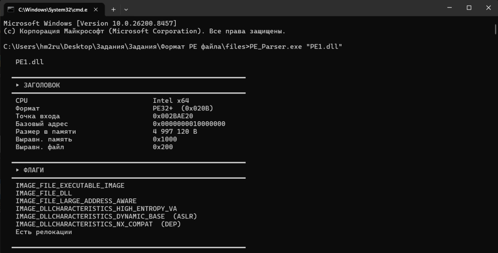
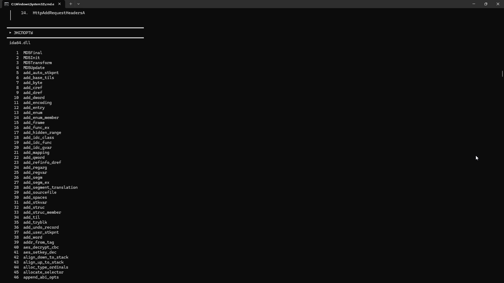

# PE Parser
Программу можно скачать в Releases (сборка в Visual Studio 2022)
Название флагов для характеристик DLL взято с официального сайта Microsoft (https://learn.microsoft.com/en-us/windows/win32/debug/pe-format)

## Использование на PE1.dll

## Использование на PE2.exe

[Исходный код тут](Program.cs)
